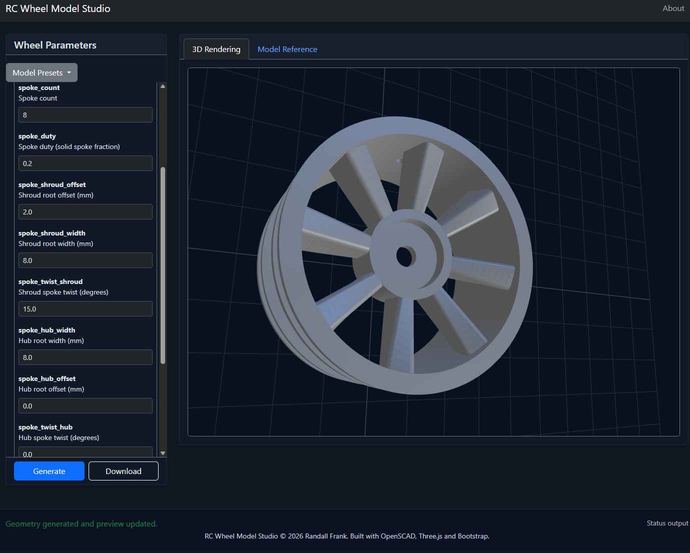
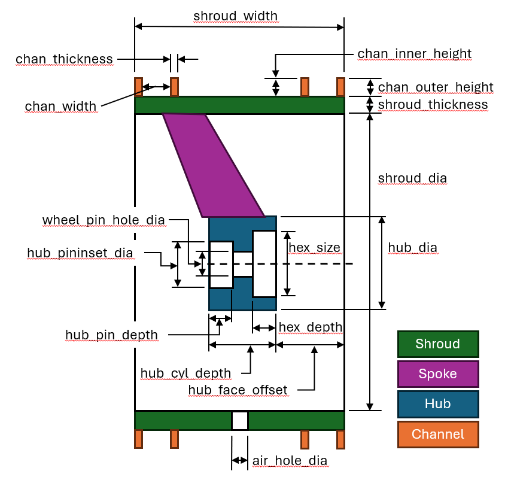
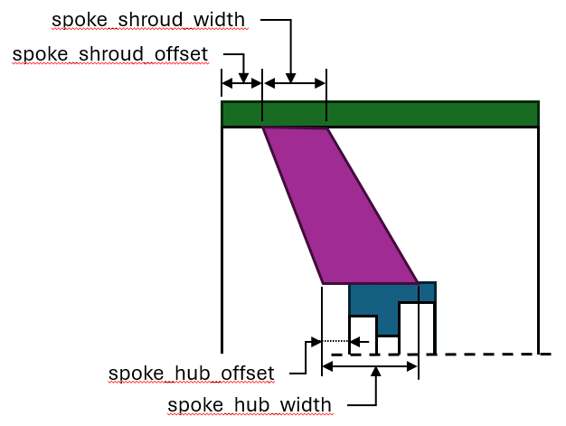

RC Wheel Model Studio
=====================
|MIT| |openscad| |threejs| |bootstrap| |python| |Itch|

.. |bootstrap| image:: https://img.shields.io/badge/Bootstrap-7952B3?logo=bootstrap&logoColor=fff
   :target: https://getbootstrap.com/

.. |threejs| image:: https://img.shields.io/badge/Three.js-044?logo=threedotjs&logoColor=fff
   :target: https://threejs.org/

.. |python| image:: https://img.shields.io/badge/Python-3776AB?logo=python&logoColor=fff
   :target: https://www.python.org/

.. |MIT| image:: https://img.shields.io/badge/License-MIT-yellow.svg
   :target: https://opensource.org/licenses/MIT

.. |Itch| image:: https://img.shields.io/badge/Itch.io-fa5c5c.svg
   :target: https://myleftgoat.itch.io/

.. |openscad| image:: https://img.shields.io/badge/OpenSCAD-57A143.svg
    :target: https://github.com/openscad/openscad/

Overview
--------

This web application allows one to generate custom wheels compatible with common RC cars.  The model can be modified to change:

* Wheel diameter
* Hex driver size
* Center hex placement
* Tire mounting geometry: ridge depth, width and presence
* Spoke count (can be solid), twist and connection geometry
* Many other options

The resulting stl file can be printed locally or sent to a service, opening the door for aluminum or other materials.  One might want to experiment with plate orientations to get the best results.    

Creating the application
------------------------

Requirements
~~~~~~~~~~~~

- Python 3.10 or higher for organizing the build and acting as a local web server.

Building
~~~~~~~~

Start by creating a Python virtual environment and install all the necessary
dependencies:

.. code:: Powershell

    pip install virtualenv
    python -m virtualenv venv
    ./venv/Scripts/activate.ps1   # for Windows PowerShell, different for other shells
    pip install -r requirements.txt

To build, one can run the command `python build.py build` and then serve 
the application using the command `python build.py serve`.  

*build.py* has several options:

- clean

  - Remove the contents of the `build` directory.

- build, fullbuild

  - rebuild the entire `build` directory. This does a `clean` followed by copying
    the contents of the `src/html` and `src/media` directories into `build`.  Finally,
    it does a `build` which regenerates the application.

- serve [--port {portnumber}] [--nobrowser]

  - This option starts a web server that serves up the contents of the `build`
    directory on the selected port.  This simulates an actual web deployment. The
    default port is 9000.  By default, a web browser tab will be opened to view 
    the application. `--nobrowser` may be used to suppress the opening of the tab.

- release

  - This will first execute a `build` operation, then create a zip file of the
    contents of the `build` directory.  It will generate a file named: `wheels_vX.Y.Z.zip` where X.Y.Z is the current build version from version.txt.  The resulting
    zip file can be served to run the application.  It can be used on platforms like
    `itch.io <https://itch.io>`_.

Running
~~~~~~~

A prebuilt version is comitted into the github pages for this repository and can be viewed at: `RC Wheel Model Studio <https://randall-frank.github.io/wheel_studio/>`_.

Otherwise, one can use the `build.py` file to build and run the application:

.. code:: Powershell

    > python build.py build
    INFO:wheels_build:Operation complete
    > python build.py serve --nobrowser  
    Serving application:  http://127.0.0.1:9000

At this point, pointing a browser to: `http://127.0.0.1:9000 <http://127.0.0.1:9000>`_
will allow one to run the application.

Model Specifics
---------------
The nomenclature used in the model reflects my experience with turbomachinery.  The model consists of an outer cylinder (the shroud) and in inner cylinder (the hub).  The two are connected via “spokes”.  When thinking about spokes, divide 360 degrees by the number of spokes and then  adjust the spoke “duty” to select how much of the angle is solid vs open (think 'duty cycle'). On the outside of the shroud, there are two (optional) “channels” that guide where the tires are glued to the wheel. The list of parameters can be a bit daunting.
The next images are cross-sections through the wheel with many of the various options displayed.  
For the wheel itself:

This covers most options except for the spokes.  
Spoke parameters look like this:

License
-------

This work is licensed under the MIT license and is copyright (C) 2026 Randall Frank.

